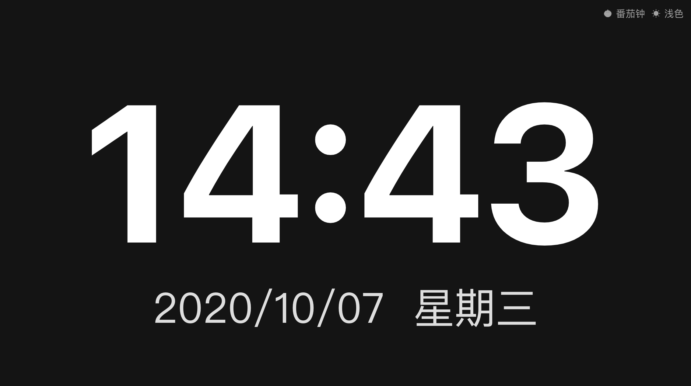
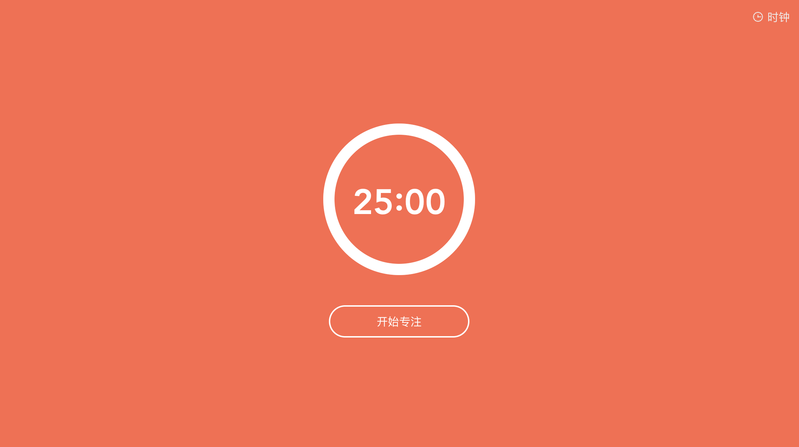
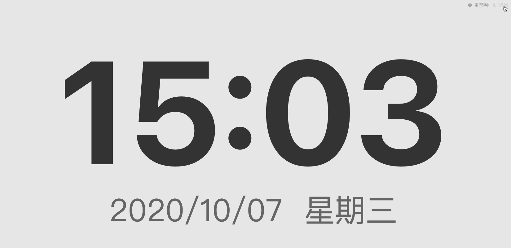
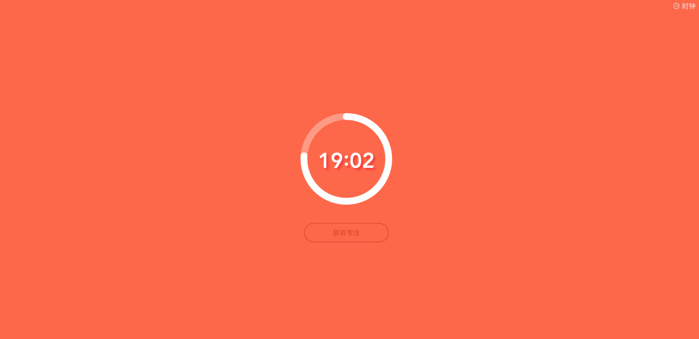
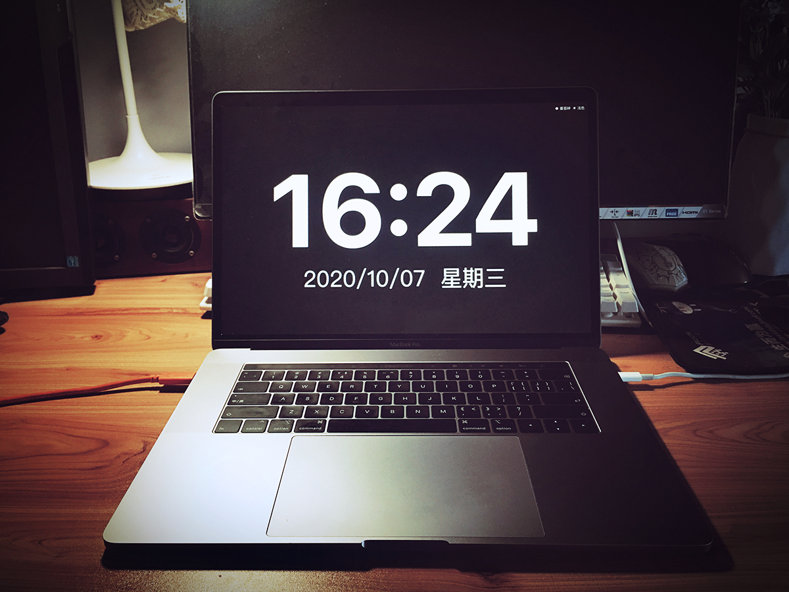

 

  
  
  

> *A simple clock application based on vue3 and vite.* 
> 一个简单的时钟应用，包含电子时钟和标准的番茄钟，时钟模式下可以切换浅色和暗黑模式，适配移动端横竖屏，欢迎issue。

 

### 一、主要功能

- 电子时钟功能，如图：
     
      
- 标准番茄钟功能，如图：
     
     
 

### 二、使用演示
   
   
   
 

### 三、使用方法

1、下载项目代码，安装依赖，npm和yarn均可

> npm install 或 yarn

2、运行项目

> npm run dev 或 yarn dev

3、打包

> npm run build 或 yarn build

### 版权

— MIT License —
